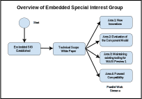

# **Proposal to Create a SIG-Embedded and Industrial Applications**

This document is a proposal to create SIG-Embedded and Industrial Applications as a formal Special Interest Group (SIG) under the auspices of the TSC of the Bytecode Alliance, as specified in the TSC’s charter.

## **The Goal of the Embedded Special Interest Group**

The goal of the special interest group is to work toward a common baseline of support for runtimes and tooling across the WebAssembly ecosystem and particularly addressing the embedded community. This entails addressing the unique constraints of the embedded ecosystem and its devices while supporting binary portability between all devices and runtimes. The best way to achieve this is with a unified ecosystem of tools, technologies, documentation, and support.

## **Meeting Schedule**

To ensure that all interested members of the WebAssembly community can participate, the SIG will arrange regular meetings which rotate between time slots most suitable for Asia, Europe and the Americas. It would therefore be desirable to have three co-chairs, preferably, one from each time-zone who would help facilitate the regular meetings.

## **Advantages of WebAssembly and WASI for the Embedded Ecosystem**

WebAssembly and WASI bring four key advantages to the embedded ecosystem

1. Binary device portability across ISAs (Instruction Set Architectures) and platforms
2. Support for more programming languages and language interoperability on embedded devices
3. Forward compatibility with newer application toolchains over multiple decades
4. Secure and sandboxed execution of software, where other solutions like containers do not fit

while ensuring two important properties

1. Support for existing (pre-WebAssembly / pre-WASI ) software
2. While remaining as near to native efficiency in execution and compilation as possible
   This will be measured as:
   1. ROM size for the compiled binary code sizes, both for runtime and the compiled byte code to be executed (including AoT).
   2. RAM size for consumed memory during execution
   3. Compilation time from source, through linking right to .wasm and also to any ahead of time format

## **Supporting an Existing Ecosystem**

These advantages have helped create an existing WASM/WASI embedded ecosystem and today there are millions of devices deployed with WASI Preview 1 from multiple vendors. A key challenge facing the embedded SIG is how to maintain support for this ecosystem, and provide for innovation on the technologies currently employed, while simultaneously enabling convergence on common emerging standards.

## **Deliverable: Technical Scope Whitepaper**

The embedded marketplace contains a huge landscape of devices, Real Time Operating Systems / software platforms, hardware types and a myriad of acceleration solutions. In order for the SIG to function successfully it is important to define the subset of this landscape that the SIG will seek to address. Specifically the most limited hardware platforms that will be addressed.

The SIG will initially work on this definition, producing a whitepaper that defines the scope of the hardware and software that all members of the SIG will seek to support. To ensure accessibility to all participants this should be based on hardware platforms which are easily accessible. In detail, this includes

- A set of publicly available hardware platforms defining the lower limit of support
- A set of additional hardware and software constraints such as dynamic memory allocation limitations, FPU locking, cache locking behavior, setting MMU behavior. This could also include XIP (execute in place) and mapping read only memory pages.
- A set of common software patterns and application models that showcase the unique constraints and tradeoffs of the embedded wasm ecosystem

This deliverable will become a functional cornerstone shaping the work that the SIG will undertake going forward.

## **The Approach and the Deliverables**

The Embedded Special Interest Group will address the complex challenge of seeking to keep the advantages defined above, while addressing the challenges of the existing ecosystem, and doing all of this within the technical scope of the initial deliverable. To accomplish these technical challenges it is necessary to break it down into four key areas that the Embedded Special Interest Group will focus on.

### **Area 1: Supporting New Innovations Specific to the Embedded Ecosystem**

The embedded ecosystem requires new system interface APIs around hardware access, e.g. I2C, SPI, GPIO, and USB interfaces. These require new common standards to be created. In addition, the existing ecosystem has already produced many additional innovations, such as variable size memory pages, which are yet to become standard approaches. These innovations, where appropriate, should be standardized across the wider ecosystem.

#### Area 1 Deliverables

##### Standard Proposals for WASM CG, and WASI SG

This Area will produce proposals for new common standards. These will be proposed to and follow the standards process as outlined by the WebAssembly Community Group for proposals related to core WebAssembly, and to the WASI Sub Group for proposals related to the WASI Standards.

##### Technical Open Source Contributions

As part of the standards process it will be necessary to contribute to various runtimes, and possibly to the WASI SDK. Any such contribution will follow the conditions, process and guidelines stipulated by the receiving open source project.

### **Area 2: Evaluation of the Component Model for use on embedded devices**

The WASI Sub Group has produced the Component Model as a building block for a future WASI 1.0 standard, and has announced its intention to provide scope for community feedback on a series of preview releases. The Component Model encompasses many constituent elements, including:

- The WIT definition language
- WIT tooling / SDK Support
- The Canonical ABI

The embedded SIG will assist in this task by evaluating and providing feedback on the Component Model when applied to the embedded ecosystem and the range of devices defined in the Technical Scope White paper discussed above.

#### Area 2 Deliverables

##### Technical Notes for WASI SG

The deliverables from this area will be a set of technical notes which will be shared with the WASI Sub Group and its members. To assist the sub group and the contributors to the Component Model these notes should seek to contain as much detail as possible, including, but not limited to:

- Technical Concerns; these should be expressed, preferably as a use case or example code along with the written definition of the issue and expected behavior or positive outcome. These should be shared via github in a repository the SIG uses to communicate concerns and example use cases. Examples of this could include:
  - Benchmark timing, and expected timing performance
  - A comparison on differing ABIs and the number of instructions needed for each ABI, with a target or preferred count expressed
- As much information as possible of the use case in which the technical concerns arose, bearing in mind that the disclosure of this information in a public forum like the WASI Sub Group may be limited due to the commercial sensitivity of the use case.
- A set of suggestions for possible mechanisms to address the concerns

### **Area 3: Support for maintaining the existing tooling for WASI Preview 1**

The existing embedded ecosystem is invested in WASI Preview 1 as a consequence support for this needs to continue. This area will focus on how to achieve this, and will primarily be focused on the WASI SDK.

#### Area 3 Deliverables

##### Technical Notes for WASI SG

This area will seek to provide use cases explaining the need for ongoing WASI Preview 1 support, and what scope of support is required.

##### Technical Open Source Contributions

This area may contribute to the WASI SDK to help continue support for WASI Preview 1. Any such contribution will follow the conditions, process and guidelines stipulated by the WASI SDK.

### **Area 4: Forward Compatibility / Roadmap to Future Convergence** 

The embedded ecosystem is currently invested in WASI Preview 1 and there will be an inevitable delay before being able to adopt future standards. During this delay commercial pressures will continue to push for innovation and result in further investment in the Preview 1 toolset. This raises the risk that heavy investment in preview 1 will result in making it too costly for organizations to migrate to future common standards.

#### The Goal of Area 4

To offset this risk, this area will investigate ways in which innovation conducted with the Preview 1 toolsets currently used by the embedded ecosystem can be forward compatible with future common standards. This may also involve addressing the existing fragmentation within the preview 1 landscape, e.g. this could include addressing the plethora of runtimes with differing socket and threading implementations.

The exact mechanisms used to provide forward compatibility and the scope of work necessary to ensure that future standards can be adopted will be determined by Area 4. This could involve building upon the set of publicly available hardware platforms defined by the initial deliverable by providing testing and conformance tooling to ensure that future runtimes can be tested and verified against this hardware list. This may involve defining tests and creating hardware in the loop testing solutions.

#### Area 4 Deliverables

##### Technical Scope White Paper

Area 4 will need to define its technical scope, determining what APIs, or what type of APIs and innovation it will need to ensure forward compatibility for. It may also need to review the status of the existing fragmentation in Preview 1. It will also seek to define the mechanisms for which forward compatibility can be provided. This will be captured in a white paper which Area 4 will produce.

##### Technical Notes for WASI SG

Based on the scope of work determined in the technical white paper Area 4 will provide technical notes to the WASI SG detailing the features which require forward compatibility and the mechanism to be employed to provide this.

##### Technical Open Source Contributions

The mechanisms for forward compatibility, and the APIs and interfaces being supported, may require contributions to runtimes or to the WASI SDK or supporting tooling. Any such contribution will follow the conditions, process and guidelines stipulated by the receiving open source project.

### **Cross Cutting Deliverables**

#### An Embedded Use Case Repository 

As part of work outlined above it may be necessary to document and provide examples of some of the use cases required in the embedded community. This can be done via textual descriptions and example code; these will be shared via an embedded use case repository on GitHub with all contributions available under an Apache 2 license. 

#### Hardware in the loop CI/CD Solutions

As part of the work the SIG conducts it may be necessary for organizations to provide hardware to be used for validation and testing of proposed solutions, use cases etc. These hardware platforms can be hosted by the donating organizations and made available to members via github actions attached to SIG specific GitHub repositories. 

## **Supporting members**

- Chris Woods (Siemens) @woodsmc
- Dominik Tacke (Siemens) @tacdom
- Thomas Trenner (Siemens) @ttrenner
- Merlijn Sebrechts (imec) @merlijn-sebrechts
- Stephen Berard (Atym) @srberard
- Marcin Kolny (Amazon) @loganek
- Emily Ruppel (Bosch) @kangaruppel
- Friedrich Vandenberghe @Zelzahn
- Xin Wang (Intel) @xwang98
- Qi Huang (Xiaomi) @no1wudi
- Dongsheng Yan(Sony) @dongsheng28849455
- Wenyong Huang (Intel) @wenyongh
- Christof Petig (Aptiv) @cpetig
- Petr Penzin @ppenzin
